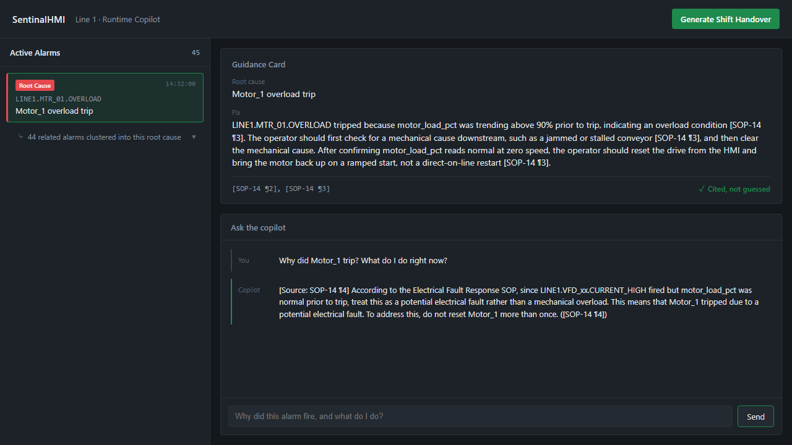
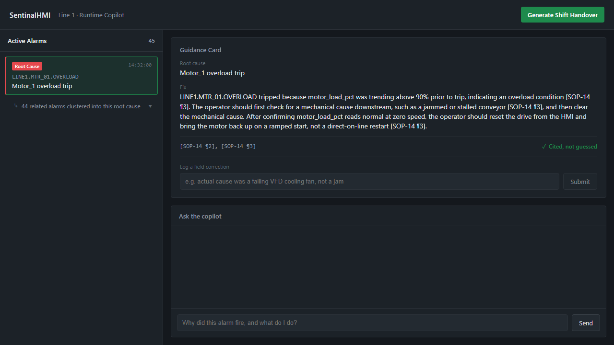
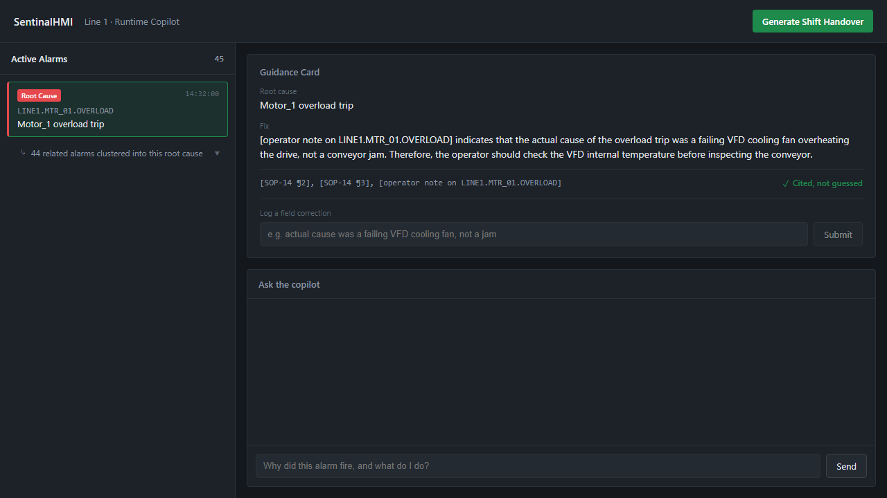

# Root Cause Advisor

**Stop drowning operators in alarm floods. Cluster the noise down to the one root cause, ground the fix in real SOPs, and run it fully offline.**

When a single equipment fault trips, it cascades into 40+ downstream alarms within minutes. An operator staring at a raw alarm banner has no way to tell the root cause from the noise. Root Cause Advisor sits between the alarm system and the operator: it detects the flood, identifies the root alarm (ISA-18.2), retrieves the matching SOP procedure, and hands back a grounded, cited answer — with an explicit guardrail against ever guessing when no procedure matches. Everything runs on local, offline inference (Ollama), so it works on plant-floor hardware with zero cloud calls and zero data leaving the OT network.

## How it works

```
Alarm flood (40+ alarms) ──▶ ISA-18.2 flood detection ──▶ root alarm identified
                                                                   │
                                                                   ▼
                                            RAG retrieval over SOPs (ChromaDB + Ollama)
                                                                   │
                                                                   ▼
                                    Guidance Card: root cause, fix, citation, ✓ cited-not-guessed
                                                                   │
                                                                   ▼
                                   Operator correction note ──▶ persisted, outranks static SOP next time
```

- **Alarm flood clustering** — groups 40+ cascading alarms under the single root cause that triggered them, instead of showing them as unrelated events.
- **Grounded, cited answers** — every answer is retrieved from real SOP documents and cites the section it came from. If nothing matches, it says so explicitly rather than hallucinating a fix.
- **Self-improving feedback loop** — an operator's correction note is stored and outranks the generic SOP on the next matching alarm, so the system gets sharper with real shift experience.
- **Anomaly confirmation** — an Isolation Forest model flags which sensor reading is actually abnormal, backing up the alarm with real signal.
- **Shift handover generation** — summarizes the shift's alarms and operator notes into a handover note on demand.
- **Fully offline** — inference runs against a local Ollama model; no data leaves the plant network.
- **Real Modbus/EcoStruxure integration path** — a Modbus TCP bridge can feed live PLC/simulator tag data in alongside (or instead of) the synthetic flood.

## Screenshots

**Alarm flood clustered to one root cause, with a grounded, cited answer:**



**Self-improving feedback loop — same question, before and after an operator correction:**

| Before: generic SOP | After: operator's own correction |
|---|---|
|  |  |

## Project structure

```
backend/        FastAPI service — routes, RAG pipeline, anomaly detection, flood clustering
frontend/       React + Vite operator UI — alarm panel, guidance card, chat, shift handover
data/           Synthetic alarm flood, process data, and the SOP library it's grounded in
integration/    Modbus TCP bridge for real EcoStruxure/PLC tag data
docs/           Architecture notes, EcoStruxure integration plan
```

## Running it

Backend and frontend are two separate processes — run each in its own terminal, both need to stay up together.

### Backend

```bash
cd backend
python -m venv venv
venv\Scripts\activate        # macOS/Linux: source venv/bin/activate
pip install -r requirements.txt

# Pull a small local model once (needs Ollama installed: https://ollama.com)
ollama pull llama3.2:3b

uvicorn main:app --reload --port 8000
```

Ingest the SOP library into ChromaDB before asking real questions (one-time, or whenever `data/sops/` changes):

```bash
python scripts/test_real_sops.py
```

> **First-run gotcha:** the embedding model (`all-MiniLM-L6-v2`) downloads from Hugging Face the first time you ingest. On some networks the fast "Xet" CDN path silently hangs at 0 bytes instead of erroring. If ingestion or the first request seems to hang forever, set `HF_HUB_DISABLE_XET=1` before running Python — it forces the plain-HTTPS fallback, which is slower but reliable. It's a one-time download; cached after that.

### Frontend

```bash
cd frontend
npm install
npm run dev
```

Opens at `http://localhost:5173`. It talks to the backend at `http://localhost:8000` by default — if that port is taken on your machine, override it with a `frontend/.env.local`:

```
VITE_API_URL=http://localhost:8001
```

### Optional: live Modbus data

```bash
cd integration
python modbus_sim_server.py      # simulated PLC, or point at real EcoStruxure
python telemetry_bridge.py       # polls tags, writes data/live_telemetry.json
```

Wiring a real EcoStruxure HMI screen to this same simulator as a second Modbus client: [`docs/ecostruxure-integration-plan.md`](docs/ecostruxure-integration-plan.md).

## API

All routes are served at the backend root (no `/api` prefix).

| Route | Method | Purpose |
|---|---|---|
| `/root-cause` | POST | Given a list of alarms, runs ISA-18.2 flood detection and returns the root alarm, suppressed count, and a grounded RAG answer for it |
| `/explain-alarm` | POST | Grounded answer for a single alarm tag (`{alarm_tag, question?}`) |
| `/ask` | POST | Free-text operator question, not tied to a specific alarm |
| `/shift-handover` | POST | Summarizes a shift's alarms + operator notes into a handover summary |
| `/feedback` | POST | Stores an operator's correction note against an alarm tag, recency-boosted on retrieval |
| `/health` | GET | Liveness check |

Every RAG-backed route returns `{answer, citations, no_match, error}` — `no_match` is a clean guardrail state (nothing in the SOP library matched), distinct from `error` (the AI backend itself is unreachable/degraded). The frontend renders both as clear, non-crashing states rather than a raw error.

## Demo flow

1. **Raw feed (before)** — the app opens on a bare, legacy-style flat alarm table: 45 undifferentiated alarms, no clustering, no AI. This is what the operator sees today.
2. **Launch Root Cause Advisor** — switches to the real app: the flood is clustered to one root cause (`Motor_1 overload trip`) with 44 related alarms collapsed under it.
3. Ask the copilot *"Why did Motor_1 trip and what do I do?"* — grounded answer with an SOP citation.
4. Anomaly detection flags the actual abnormal sensor reading behind the trip.
5. Operator adds a correction note — the next matching query surfaces that note ahead of the generic SOP.
6. **Generate Shift Handover** — auto-summarizes the shift.
7. Fully offline: disconnect the network, the pipeline still answers from the local model.

For judge Q&A — every design decision explained in plain English and technical terms, plus the real bugs we found and fixed while testing: [`docs/technical-deep-dive.md`](docs/technical-deep-dive.md).

## Team

- **Nikhil** — backend: RAG pipeline, anomaly detection, alarm clustering, guardrails
- **Mahesh** — frontend, synthetic data
- **Manjunath** — Modbus/EcoStruxure integration, edge hardware validation
